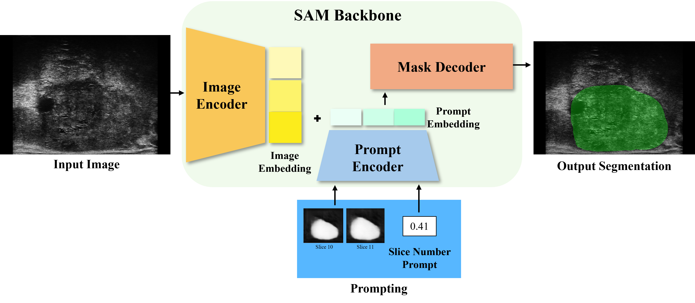

# SliceTrack-SAM
An adaptation of the Segment Anything foundation model with novel prompting strategies providing 3D awareness for prostate segmentation on rotational micro-ultrasound scans of the prostate.

## Methodology


## Dataset
The dataset used to validate our method is the [MicroSegNet](https://github.com/mirthAI/MicroSegNet) data: Micro ultrasound prostate images which can be found [here](https://zenodo.org/records/10475293). The data splits can be found in ./data. 

## Results
#### Our results can be replicated using the following statements.
**Train**
```
python finetune_sam.py -save_path "./work_dir/SliceTrackSam" -saved_model_name "SliceTrackSam" -backbone "sam" -batch_size 32 -num_epochs 100 -patience 10 -img_size 256 -mask_size 64 --use_float_prompt --use_prev_mask -random_prev_mask_prob 0.6 -augment True -h_flip_prob 0.5 -optimizer "adamw" -wd 0.01
```
**Test**
```
python inference_samPrev.py -chkpt "work_dir/SliceTrackSam/SliceTrackSam.pth" -backbone "sam" -save_path "work_dir/SliceTrackSam/pred" -img_size 256 -mask_size 64 -useFloatPrompt True
```

## Installation
Create a virtual environment `conda create -n sliceTrackSAM python=3.10 -y` and activate it `conda activate sliceTrackSAM`

Install [Pytorch 2.0](https://pytorch.org/get-started/locally/)

**Clone the repository (or fork and clone fork)**:

```
git clone https://github.com/yourusername/prostate-seg.git
cd prostate-seg
```
Download the [SAM model checkpoint](https://github.com/facebookresearch/segment-anything?tab=readme-ov-file#model-checkpoints) or [MedSAM model checkpoint](https://drive.google.com/drive/folders/1ETWmi4AiniJeWOt6HAsYgTjYv_fkgzoN?usp=drive_link) and place it at `./chkpt`

**Install dependencies**
```
pip install -r requirements.txt
```


## Training

### Finetuning the maskdecoder 
**To train just the SAM or MedSAM maskdecoder (without prompts)**
```
python finetune_sam.py -save_path "./work_dir/sam_finetune_256" -saved_model_name "sam_finetune_256" -backbone "sam" -batch_size 32 -num_epochs 100 -patience 10 -img_size 256 -mask_size 64 -augment True -random_prev_mask_prob 0 --freeze_img_encoder -wd 0.01 --use_scheduler -h_flip_prob 0  -decoder_lr 1e-4
```

**To train just the SAM or MedSAM maskdecoder WITH previous mask prompts**
```
python finetune_sam.py -save_path "./work_dir/sam_finetune_256_prev" -saved_model_name "sam_finetune_256_prev" -backbone "sam" -batch_size 32 -num_epochs 100 -patience 10 -img_size 256 -mask_size 64 --use_prev_mask -random_prev_mask_prob 0.6 --freeze_img_encoder -augment True -h_flip_prob 0.3 -crop_pad True -optimizer "adamw" -wd 0.01
```

### Finetuning the backbone 
**To train the SAM or MedSAM backbone (without prompts)**
```
python finetune_sam.py -save_path "./work_dir/sam_backbone_256" -saved_model_name "sam_backbone_256" -backbone "sam" -batch_size 32 -num_epochs 100 -patience 10 -img_size 256 -mask_size 64 -augment True -h_flip_prob 0 --use_scheduler

```

**To train the SAM or MedSAM backbone WITH both prompts (SliceTrack-SAM)**
```
python finetune_sam.py -save_path "./work_dir/sam_backbone_aug_w_flip_float_prev_adamw_wd" -saved_model_name "sam_backbone_aug_w_flip_float_prev_adamw_wd" -backbone "sam" -batch_size 32 -num_epochs 100 -patience 10 -img_size 256 -mask_size 64 --use_float_prompt --use_prev_mask -random_prev_mask_prob 0.6 -augment True -h_flip_prob 0.5 -optimizer "adamw" -wd 0.01

```

The -backbone can be altered to train a different model (aka "medsam").

**Arguments:**  

-h, --help          
* show additional arguments

-root
* path to dataset. Default is './data'

-device
* Device to use. Default is cuda

-backbone
* Model backbone to use (sam or medsam). Default is sam.

-save_path
* path to save the model. Default is "./work_dir/finetune_SAM"

-saved_model_name
* Name of new trained model. Default is "sam_finetuned"

-img_size
* Image size for model to use. Default is 1024

-mask_size
* Mask size for model to use. Default is 256

-batch_size
* Batch size. Default is 12

-augment  
* Augment data. Default is False
  
-crop_pad  
* Augment with cropping top and bottom with padding. Default is False
    
-h_flip_prob
* Horizontal flip probability. Default is 0.5
  
-num_epochs
* Number of epochs. Default is 20

--use_scheduler
* Use learning rate scheduler. Default is False.

-decoder_lr
* Decoder learning rate. Default is 1e-3

-encoder_lr
* Encoder learning rate. Default is 1e-4

-wd
* Weight decay. Default is 0.01

-patience
* Patience for early stopping. Default is 5

--use_prev_mask
* use previous mask prompt. Default is False

--use_middle_mask
* use middle mask prompt. Default is False

-random_prev_mask_prob
* random previous mask probability. Default is 0.5

--use_float_prompt
* Use floating point prompts. Default is False

-optimizer
* Optimizer to use. Default is adam

-loss_fn
* Loss function, options are: mse, bcel, bce. Default is bce.
  
--freeze_img_encoder
* freeze image encoder. Default is False

--freeze_mask_decoder
* freeze_mask_decoder. Default is False


## Inference
```
python inference_samPrev.py -chkpt "work_dir/sam_backbone_256/sam_backbone_256.pth" -backbone "sam" -save_path "work_dir/sam_backbone_256/pred" -img_size 256 -mask_size 64
```
